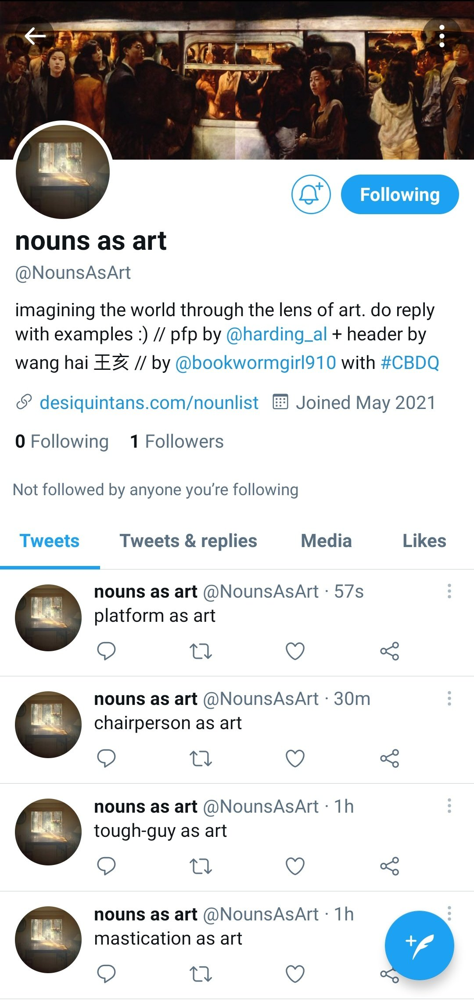

# NounsAsArt

A Twitter bot running on Cheap Bots, Done Quick! by v21 / v buckenham. Noun list curated by Desi Quintans at http://desiquintans.com/nounlist. Images used are Alexander Harding's "Visible Light" and Wang Hai's "From Tsuen Wan to Central" (王亥「從荃灣到中環」).

## some top liked tweets

**nouns as art** @NounsAsArt  
website as art  
5:54 PM • Oct 15, 2022  
♡ 19

**nouns as art** @NounsAsArt  
temporary as art  
7:21 PM • Oct 4, 2022  
♡ 4

**nouns as art** @NounsAsArt  
anyone as art  
6:21 PM • Oct 8, 2022  
♡ 2

**nouns as art** @NounsAsArt  
instrument as art  
2:51 PM • Oct 11, 2022  
♡ 2

**nouns as art** @NounsAsArt  
breakdown as art  
1:23 AM • Oct 13, 2022  
♡ 2

**nouns as art** @NounsAsArt  
household as art  
5:24 PM • Sep 13, 2022  
♡ 1

**nouns as art** @NounsAsArt  
technology as art  
8:55 AM • Sep 14, 2022  
♡ 1

**nouns as art** @NounsAsArt  
evening-wear as art  
6:24 AM • Sep 17, 2022  
♡ 1

**nouns as art** @NounsAsArt  
hospitality as art
1:24 PM • Sep 17, 2022  
♡ 1

**nouns as art** @NounsAsArt  
pardon as art  
10:54 PM • Sep 17, 2022  
♡ 1

## original tweet thread

10:19 PM • May 17, 2021

hello! i made a (first?) twitter bot! its name is @NounsAsArt and i've been checking it repeatedly in excitement since it went live last night. i'd love if you could check it out and offer up some examples, if you feel so inclined 😊  

i was thinking about the way people can see so many things as ~art~, even if they're not remotely related to art and not typically seen as art. it can be a beautiful way to see the world and also a great source of creative inspiration  

the bot is tweeting through a list of 6,775 nouns, as curated by @eco_desi at http://desiquintans.com/nounlist. it was built (SO quickly and easily!! 🤩) with #CheapBotsDoneQuick by @v21  

the two images on the profile are @alharding’s “visible light” and wang hai’s “from tsuen wan to central” (王亥「從荃灣到中環」), which are two images that represent moments of life that have made me feel ~art~ – specifically light/domesticity and crowds  

my hope is for this to be a kind of creative crowdsourcing experiment, that we can learn to see the world in the weird and wonderful ways that others see it, and make art out of it (“art”, as always, expansively defined here)  

(potential futures: a searchable spreadsheet of some sort containing everyone's associations, examples, links, comments to each NounsAsArt?)  